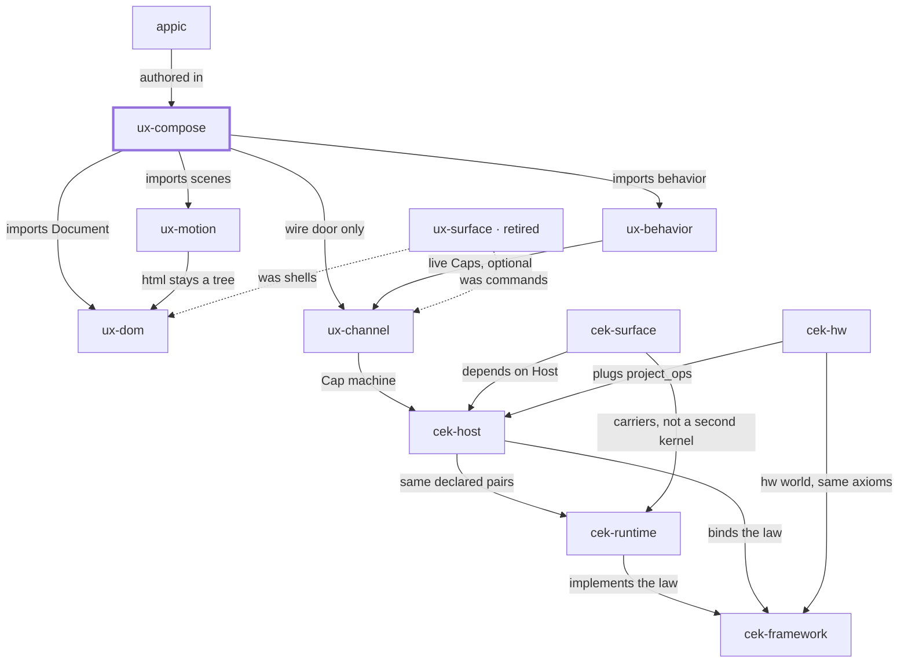

# Place in the stack

**You are here:** `ux-compose` in [bitplorer/ux-compose](https://github.com/bitplorer/ux-compose).

The composition root. It may look like the product to an author. It must import the specialists. It must not copy them.

The picture is the same in every repo. The thick stroke is this library. A missing line is a missing door, not a forgotten one. Dashed lines are history.

## Owns

Author composition, the product CLI (create-app, build, serve, deploy, doctor), Tailwind, and WebAssets layout.

## Refuses

A second Document, a second wire codec, a second motion IR, or a StateStore of its own.

## Install

Not on PyPI. Install from git, then pip install -e ".[serve]". Import ux_compose. CLI uxcompose.

## Doors

### Uses

- [ux-dom](https://github.com/bitplorer/ux-dom) — imports Document
- [ux-behavior](https://github.com/bitplorer/ux-behavior) — imports behavior
- [ux-motion](https://github.com/bitplorer/ux-motion) — imports scenes
- [ux-channel](https://github.com/bitplorer/ux-channel) — wire door only

### Used by

- [appic](https://github.com/bitplorer/appic) — authored in

## The stack

## The walk

Mint, intent, verify, project, apply, undo.

1. **Mint.** Host mints a Cap. The subject on the Cap is the subject in the args. dev is the workshop. prod refuses the workshop secret.
2. **Intent.** Channel carries action, args, and cap. That is the click. It is not a form post.
3. **Verify.** Host verifies the Cap before any shared-world write. A bad Cap, or a store that is down, refuses. ops is empty. The peer never mints.
4. **Project.** Only declared pairs leave the host. Baseline and ui.dom are the catalog. Hardware pairs arrive through project_ops. They are not a fork of Host.
5. **Apply.** The peer applies the ops. DOM is one world. GPIO is another. Surface carries the IR. It does not decide.
6. **Undo.** Lineage records the cause. End or revoke reverses it, or the op is marked non-reversible. A trace id never grants permission.

ux-compose assembles the walk. It is not one of the six steps.

## Notes

- wire/ is the only door to ux-channel.
- Library modules do not import the CLI.
- Serve modes are dev and prod. The words development and production fail closed.
