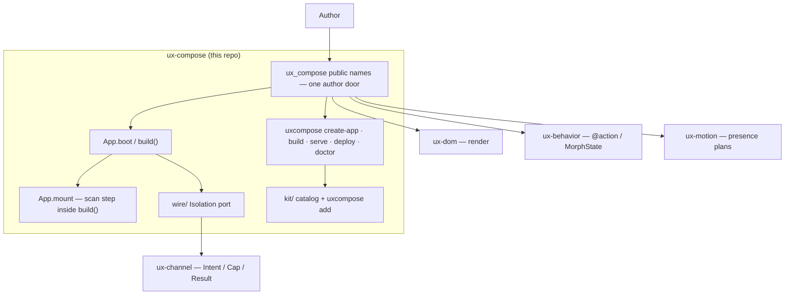

# C4-style overview — ux-compose

> **Diátaxis:** explanation · **Canonical:** `docs/internals/c4.md` · **Layer:** ux-compose
> Shape: [../ARCHITECTURE.md](../ARCHITECTURE.md). Ownership: [../FLOW.md](../FLOW.md).
> Map: [../INDEX.md](../INDEX.md).

This layer owns composition + product CLI (`uxcompose`). It does **not**
reimplement ux-dom / ux-channel / ux-behavior / ux-motion.

## Context

`build()` calls `App.mount`. One implementation, two callers (product vs
tests / surfaces). Mount is not a second product.

## Rings

| Ring | What | Port |
|------|------|------|
| 0 Author | `author.py`, helpers, Component, DOM tags | none to channel |
| 1 Host | `build()`, Clock A routing, CLI | FastAPI / DirectoryASGI degrade |
| 2 Catalog | `kit/` + `uxcompose add` | none — copy, do not import in product |
| 3 Wire | `wire/boot.py`, `wire/caps.py`, `wire/cek.py` | only importer of channel / CEK |

Progressive unlock (product order, **not** stack order): 0=dom, 1=behavior, 2=channel, 3=motion.
