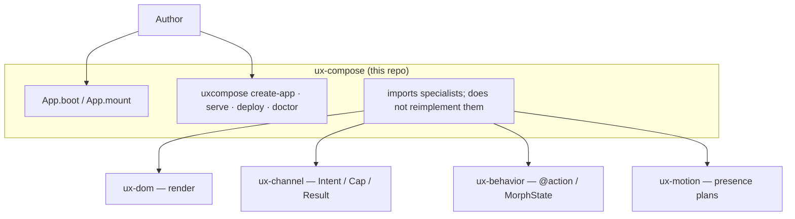

# C4-style overview — ux-compose

> **Diátaxis:** explanation · **Canonical:** `docs/internals/c4.md` · **Layer:** ux-compose
> Map: [../INDEX.md](../INDEX.md).

Grounded in [../FLOW.md](../FLOW.md). This layer owns composition + product CLI
(`uxcompose`). It does **not** reimplement ux-dom / ux-channel / ux-behavior / ux-motion.

## Context

Progressive unlock (product order, **not** stack order): 0=dom, 1=behavior, 2=channel, 3=motion.
